** TECNOLOGIAS UTILIZADAS **

Angular 16, Bootstrap 5, Angular Material, Karma 

**UX/UI**

La aplicacion sera una app-web para la gestion de un hotel

Con la interfaz implementare Bootstrap, la version cdn para que sea mas ligero junto a fontawesome.

Cree un favicon con un estilo sencillo, el diseño lo hice tanto con Bootstrap como con cambios manuales y sustituyendo propios estilos de Bootstrap.

En el aside cree un search de los modulos como se puede apreciar en el pdf, es funcional y lo implemente con ngModel para variar respecto a los otros formularios.

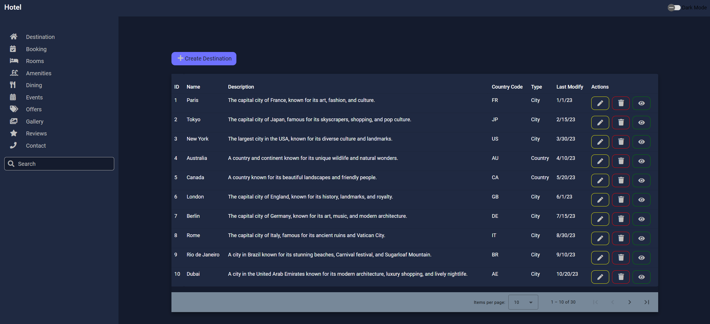
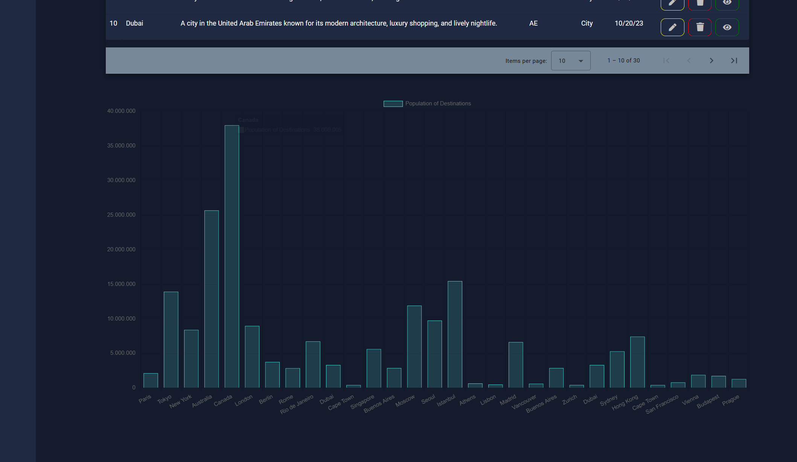
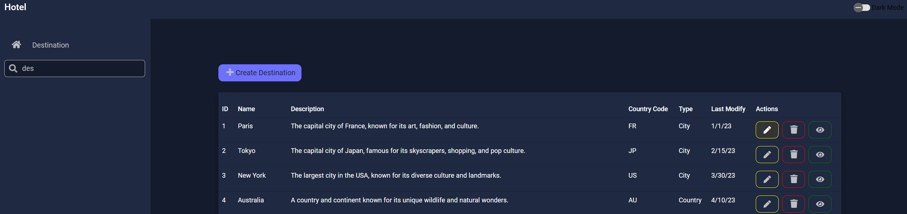
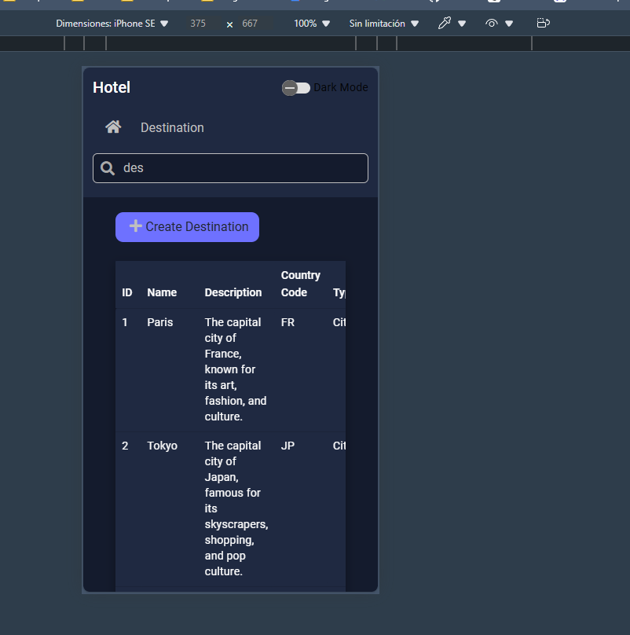
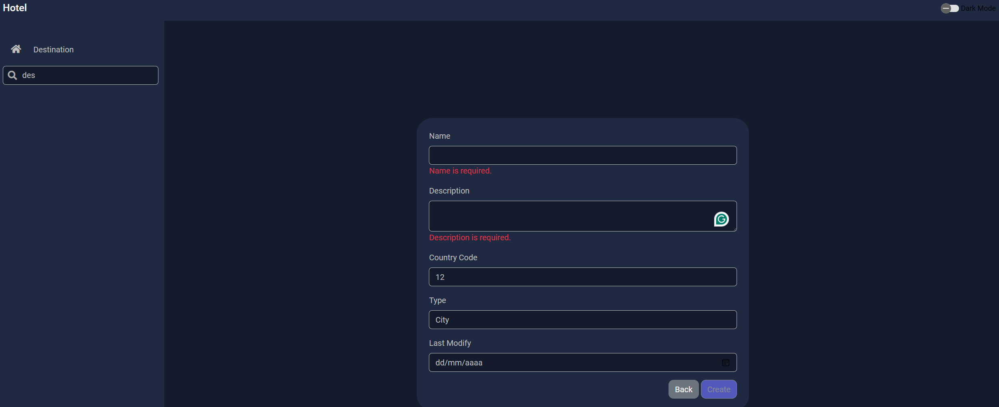
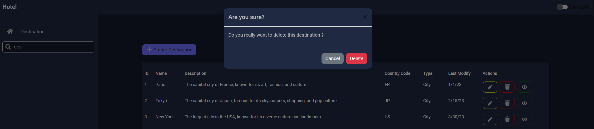
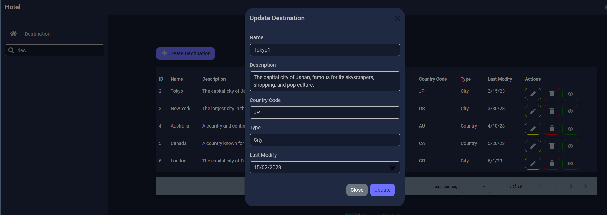
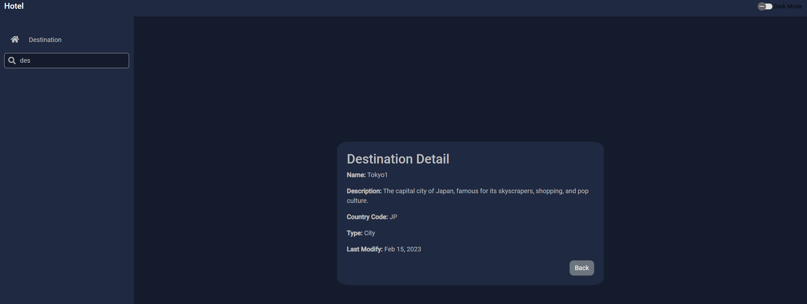
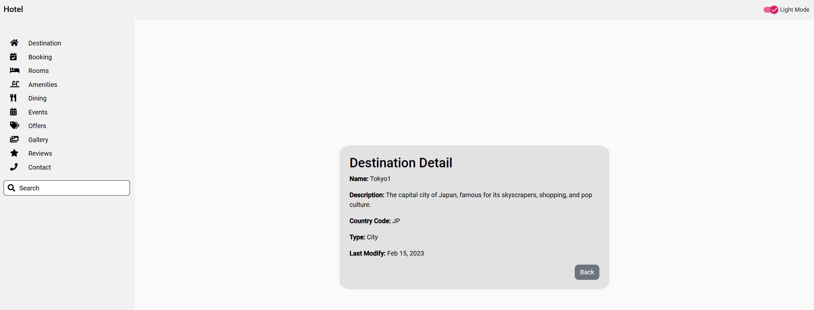

**Estructura y Arquitectura**

La muestra de los datos de Destiny, utilizare un enrutamiento lazy-loading para maximizar el rendimiento lo maximo posible, junto a ello, utilizare rxjs para dar valor añadido y mas complejidad, pensando en como evolucionara la aplicacion a futuro, a su vez implementare una paginacion para mejorar el rendimiento de los datos dado su alto volumen

Para los componentes relacionados con el CRUD de Destiny, entre todas las alternativas, decidi hacer un componente createDestiny para mostrar el uso del enrutamiento y el hecho de actualizarlo utilizare un modal en la propia pagina al igual que borrarlo de por si para mostrar el uso de diversas alternativas, priorizando mostrar usos distintos y conocimientos extra.

Ademas del CRUD decidi añadir una pagina mas de detalle para aportar valor y una pagina para control de errores como 404  

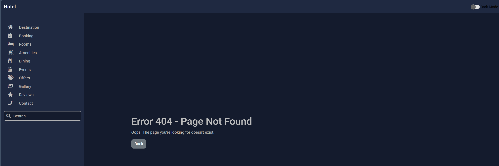

**TESTING**

He realizado los tests con Karma para destination-details y create-destination

Podeis ver los resultados en la siguiente captura:

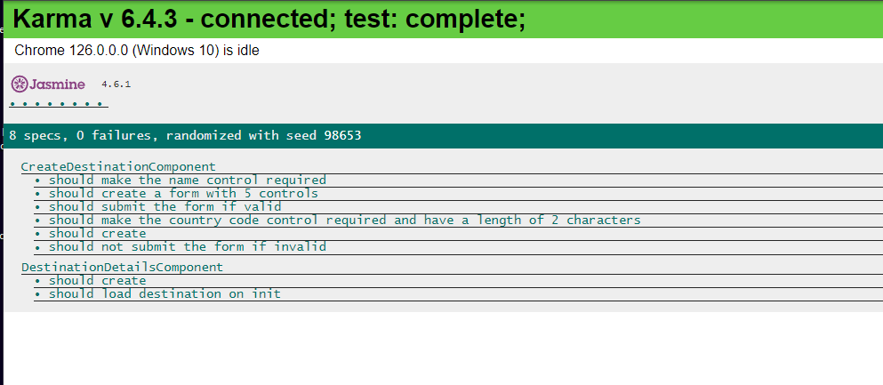

**Integracion Continua**
Cree un angular-ci.yml ficticio para simular la integracion continua con Azure

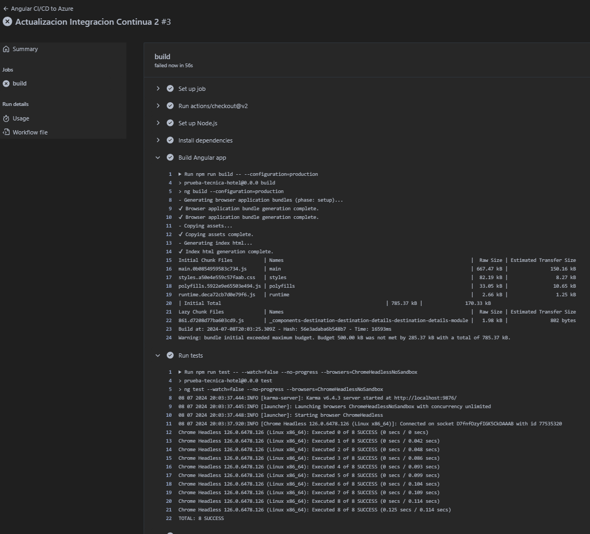